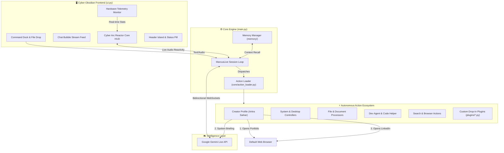

# ⚙️ MARCUS v1.0
### The Ultimate Autonomous Real-Time Personal AI Assistant
**Created by [Aritra Sarkar](https://aritrasarkarportfolio.vercel.app/)**  
[](https://aritrasarkarportfolio.vercel.app/)
[](https://www.linkedin.com/in/devaritra/)
[](https://github.com/)
[](https://www.python.org/)
[](LICENSE)

---

## 🌟 Welcome to MARCUS v1.0

**MARCUS v1.0** is a premier, cross-platform personal AI operating system and assistant engineered from the ground up to hear, see, speak, reason, and operate your machine in real time. Powered by Google's native **Gemini Live API**, MARCUS delivers bidirectional voice conversations, computer control, vision understanding, and an extensible plugin ecosystem — with **zero subscriptions** and **total user autonomy**.

Version 1.0 represents a monumental milestone, featuring a completely revamped **Cyber-Obsidian & Neon Glass** desktop interface, real-time pulsing Arc Reactor Core HUD, unified hardware telemetry, automated creator profile workflows, and 17 autonomous action capabilities.

---

## 👨‍💻 Meet the Creator & Master

MARCUS was envisioned, designed, and built by **Aritra Sarkar**, a Computer Science student from **Sammilani Mahavidyalaya (affiliated with the University of Calcutta)**.

Aritra is a multi-disciplinary technologist and experimental builder with deep passions spanning **Artificial Intelligence, Full-Stack Web Development, IoT & Embedded Systems, Cybersecurity, UI/UX Design, and Graphic Design**.

> *"Curious. Creative. Experimental. A project is more than just something to complete — it is an opportunity to learn something new and build what comes next."*

* 🌐 **Official Portfolio:** [aritrasarkarportfolio.vercel.app](https://aritrasarkarportfolio.vercel.app/)
* 💼 **LinkedIn Profile:** [linkedin.com/in/devaritra](https://www.linkedin.com/in/devaritra/)

### 🗣️ Creator / Master Profile Command
You can invoke the Creator Profile at any time via voice, text, or the UI:
* **Voice / Text Prompts:** 
  * *"Tell about your creator or master"*
  * *"Who made you?"*
  * *"Who is your creator?"*
  * *"Who is your master?"*
  * *"Tell me about Aritra Sarkar"*
* **Interactive Header Pill:** Click the **`👨‍💻 CREATOR`** pill in the top navigation island.

#### Automated Workflow:
1. **Instant Web Porting:** MARCUS immediately launches his creator's portfolio website ([aritrasarkarportfolio.vercel.app](https://aritrasarkarportfolio.vercel.app/)) in your default browser.
2. **Spoken Briefing:** MARCUS delivers an articulate, comprehensive spoken briefing covering Aritra's academic foundation, technical stack, hardware/IoT work, design philosophy, and role as an AI assistant.
3. **Automated LinkedIn Handshake:** Upon concluding the briefing, MARCUS automatically opens Aritra Sarkar's LinkedIn profile ([linkedin.com/in/devaritra](https://www.linkedin.com/in/devaritra/)) in a new browser tab.

---

## 🚀 Key Highlights in Version 1.0

### 1. 🎨 Cyber-Obsidian & Neon Glass Interface
* **Refined Aesthetics:** Deep obsidian canvas (`#03070d`), elevated glassmorphic panels (`#08101a`), neon-cyan accent highlights (`#00e5ff`), and subtle 1px border framing.
* **Modern Typography:** Styled with **Aqurine** for sleek futuristic headings and **Montserrat** for crisp, comfortable typography.
* **Dynamic Header Island:** Top navigation capsule containing real-time status pill (`LISTENING`, `SPEAKING`, `THINKING`, `MUTED`), live digital clock, and quick-action toggles:
  * `📊 SYS` — Toggle hardware telemetry sidebar.
  * `🧠 MEM` — Open long-term memory inspection modal.
  * `👨‍💻 CREATOR` — Trigger Creator Profile workflow.
  * `⚙` — Settings drawer toggle.
* **Floating Command Capsule:** Centered pill dock at the bottom for quick file attachments (`📎`), natural keyboard input, and emergency speech interrupt (`⏹`).
* **Chat Stream Feed:** Converted log panel into an interactive visual message log with labeled speech bubbles (`👤 YOU`, `🤖 MARCUS`, `⚡ ACTION`, `📁 FILE`, `⚠️ ALERT`).

### 2. ⚡ Iconic Cyber Arc Reactor Core
* **Real-Time Audio Reactivity:** The centerpiece is MARCUS's signature Arc Reactor Core that breathes, expands, and pulses dynamically to your microphone and MARCUS's voice.
* **Multi-Layered Cyber Aesthetics:** Concentric rotating energy rings, orbital tick markers, and ambient radial glow.
* **State-Aware Illumination:** Shifts colors seamlessly with system status — neon cyan while idle/listening, bright accent amber while speaking, electric violet while thinking, and muted crimson when silent.
* **Pure Vector Graphics:** Rendered smoothly with antialiased Qt gradients — lightweight, zero GPU overhead, and instant on any hardware.

### 3. 🧠 Real-Time Gemini Live Engine
* Native bidirectional audio streaming over low-latency WebSockets.
* Instant conversational turn-taking with ambient noise suppression and self-echo rejection.
* Hybrid multi-modal input: speak naturally or type commands directly into the prompt bar.

### 4. ⚡ 17 Native Autonomous Actions
MARCUS comes pre-equipped with 17 autonomous file-backed actions, auto-discovered at runtime via `core/action_loader.py`:
1. **`creator_profile`**: Creator & Master presentation workflow (portfolio & LinkedIn).
2. **`browser_control`**: Open URLs, switch tabs, search, and navigate web pages.
3. **`code_helper`**: Review, debug, and generate code snippets inline.
4. **`computer_control`**: System volume, screen brightness, WiFi toggle, lock, and shutdown controls.
5. **`computer_settings`**: Manage OS-level settings and quick toggles.
6. **`desktop_control`**: Minimize, maximize, focus, and arrange active application windows.
7. **`dev_agent`**: Autonomous multi-step development agent for code refactoring and project planning.
8. **`file_controller`**: Locate, organize, open, move, and manage local files.
9. **`file_processor`**: Read, summarize, and extract insights from documents (PDF, DOCX, TXT, CSV).
10. **`flight_finder`**: Query real-time flight availability and route pricing.
11. **`game_updater`**: Scan and trigger background updates for Steam and Epic Games titles.
12. **`open_app`**: Launch any native desktop application by common name or alias.
13. **`reminder`**: Schedule native operating system notifications and persistent timers.
14. **`screen_processor`**: Capture and analyze current screen content or webcam frames.
15. **`send_message`**: Compose and dispatch communications via WhatsApp, Telegram, or Discord.
16. **`system_monitor`**: Inspect CPU, GPU, memory, and thermal telemetry metrics.
17. **`weather_report`**: Real-time localized meteorological forecasts and conditions.

---

## 🛠️ Architecture & Workflow



---

## 💻 Installation & Setup

### Prerequisites
* **Operating System:** Windows 10/11, macOS Monterey+, or Linux (Ubuntu 20.04+, Arch, Fedora).
* **Python:** Python 3.10, 3.11, or 3.12 recommended.
* **Microphone & Speaker:** Any standard audio input/output device.
* **Google Gemini API Key:** Free tier or Pay-as-you-go key from [Google AI Studio](https://aistudio.google.com/).

### Quickstart Guide

1. **Clone the Repository:**
   ```bash
   git clone https://github.com/Devaritra009/MARCUS.git
   cd MARCUS
   ```

2. **Set Up Virtual Environment:**
   * **Windows:**
     ```powershell
     python -m venv .venv
     .venv\Scripts\activate
     ```
   * **Linux / macOS:**
     ```bash
     python3 -m venv .venv
     source .venv/bin/activate
     ```

3. **Install Dependencies:**
   ```bash
   pip install --upgrade pip
   pip install -r requirements.txt
   ```

4. **Launch MARCUS:**
   ```bash
   python main.py
   ```

5. **First-Time Setup:**
   * On initial launch, a setup wizard overlay will appear if no API key is detected.
   * Enter your **Gemini API Key**, select your OS system, and click **Connect**.
   * MARCUS will initialize, greet you, and display `LISTENING` on the status pill.

---

## 🎮 Keybindings & Controls

| Shortcut | Scope | Action |
|---|---|---|
| **Ctrl + Space** | Global (Win) / Local | **Push-To-Talk** (Hold to speak, release to send) |
| **Esc** | Local UI | Interrupt MARCUS speech / Cancel active turn |
| **Enter** | Command Bar | Send typed text command |
| **Drag & Drop** | Main Window | Attach document, image, or code file for instant analysis |

---

## 🧩 Creating Custom Plugins

MARCUS features a modular plugin architecture. To add a new skill to MARCUS, drop a single `.py` file into the `plugins/` folder:

```python
# plugins/greet_team.py

def greet_team_action(parameters: dict, player=None) -> str:
    team_name = parameters.get("team_name", "Team")
    msg = f"Greetings to everyone on {team_name} from MARCUS!"
    if player:
        player.write_log(f"MARCUS: {msg}")
    return msg

TOOL = {
    "name": "greet_team",
    "description": "Sends a warm greeting to a specified team or squad.",
    "parameters": {
        "type": "OBJECT",
        "properties": {
            "team_name": {"type": "STRING", "description": "Name of the team"}
        },
        "required": ["team_name"]
    },
    "handler": greet_team_action,
}
```
*No registry modifications required.* MARCUS will automatically discover and register your tool on the next launch!

---

## 📱 Mobile Remote Dashboard

MARCUS includes a built-in HTTPS remote control dashboard:
1. Click **Remote Control** in the MARCUS settings menu or status drawer.
2. Scan the generated QR code with your mobile smartphone (iOS/Android).
3. Access audio streaming, remote push-to-talk, status telemetry, and action triggering straight from your mobile browser.

---

## 🛡️ Reliability & Safety
* **Irreversible Action Confirmation:** Dangerous system operations (shutdown, reboot, WiFi toggle) trigger a physical confirmation banner in the UI before execution.
* **Silent NVML Diagnostics:** Integrated GPU telemetry with graceful CPU fallback and warning suppression.
* **Self-Echo Suppression:** Discards speaker output tails from the microphone stream to prevent self-triggering loops.

---

## 📜 Credits & Acknowledgments
* **Lead Creator & Master:** [Aritra Sarkar](https://aritrasarkarportfolio.vercel.app/)
* **AI Architecture:** Built on Google GenAI & Gemini Live API
* **GUI Framework:** PyQt6 with custom vector renderers
* **Portfolio:** [https://aritrasarkarportfolio.vercel.app/](https://aritrasarkarportfolio.vercel.app/)
* **LinkedIn:** [https://www.linkedin.com/in/devaritra/](https://www.linkedin.com/in/devaritra/)

---

<p align="center">
  <b>MARCUS v1.0</b> • <i>Curious. Creative. Experimental.</i><br>
  Built with ❤️ by Aritra Sarkar
</p>
